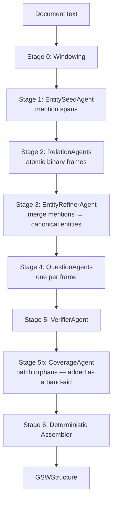
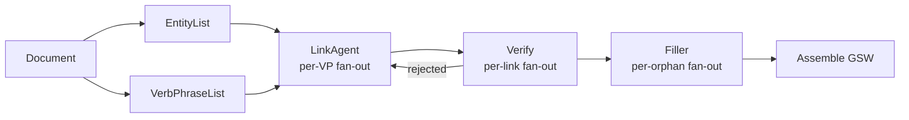

# Agentic GSW Pipeline — Evolution

> [!abstract]
> We rebuilt the GSW (Generative Semantic Workspace) construction pipeline three times in two days. This doc explains **why the first agentic design failed**, **why the interactive linker stalled on long documents**, and **how the final fan-out linker design gives clean, measurable GSWs at predictable cost**. The final pipeline has now produced 2 fully-validated GSWs from Wikipedia articles and is ready for downstream use.

## Background — what a GSW is

A GSW is a graph of:

- **Entity nodes** — canonical named things in a document (people, places, dates, organizations, works)
- **Verb phrase nodes** — binary relations between entities, each carrying a forward + reverse Q&A pair whose answers are entity IDs

The Q&A structure makes a GSW directly consumable by sleep-time bridge agents, RAG retrievers, and downstream multi-hop QA. Construction goal: take a long-form text (Wikipedia article, paper, etc.) and produce a faithful, exhaustive GSW.

The pre-existing single-shot extractor ([`FactualExtractionPrompts`](../src/gsw_memory/prompts/operator_prompts.py#L321)) crammed six tasks (entities, roles, states, verb phrases, A↔B questions, answer linking) into one prompt. When the model dropped a step, we couldn't detect or repair the gap. The agentic redesign split this into specialized stages.

---

## Pipeline V1 — `agentic_gsw` (6-stage pipeline)

### Architecture



### Where it broke

Five bugs, each exposing the next. Final failure mode: the **EntityRefinerAgent collapsed 140 mentions into 1 entity** (`"13 Hours"`). The pipeline "recovered" via 267 CoverageAgent calls taking 39 minutes, with the film entity answering **41 % of all questions** because question-agent fallbacks kept hitting it.

> [!failure] The pattern
> Every V1 bug was a **coordination failure between stages**, not a failure of any single agent. The same six agents produced 173 VPs / 15 % orphan rate under paragraph windowing, and 26 VPs / 82 % orphan rate under whole-doc windowing. The architecture works when stages cooperate; it falls apart when one stage is asked to make hundreds of global decisions at once.

8 patches later the refiner still collapsed. The patches were chasing symptoms.

---

## Pipeline V2 — Interactive LinkerAgent (brief interlude)

**Idea:** extract entities + verb phrases as flat lists in parallel, then hand both to a multi-turn interactive agent (same shape as the sleep-time bridge agent) whose termination contract forbids it from stopping until every entity and every verb phrase is wired in.

**Result:** the agent stalled on long documents. On a Wikipedia article with 112 entities + 132 verb phrases it produced **5 links in 23 iterations with 5 800-char reasoning per turn**, repeatedly writing `"I'm unable to complete the full linking within this interaction"`. Extrapolation: 50+ minutes per document.

The interactive loop was the wrong shape — the agent held **all 244 items in context** and re-planned the whole problem on every turn instead of just doing the next link.

---

## Pipeline V3 — Fan-Out LinkerPipeline (shipped)

### The design insight

Replace one big interactive agent with **Python-driven fan-out**: the orchestrator iterates; each LLM call sees **one tiny problem**.

### Architecture



**Dense steps, parallel fan-out, Python orchestrates — each LLM call sees one tiny problem.**

### What each step does

> [!info] STEP 1 — EntityListAgent (1 LLM call)
> **Input:** full source document.
> **Output:** flat canonical entity list — `[{id: "e1", name, role, aliases}]`. No mentions, no offsets. IDs assigned in a single pass.
> **Why it exists:** downstream stages need canonical IDs they can reference directly. By extracting entities in one shot up front, we avoid the V1 bug where a separate refiner had to merge 140 mentions and collapsed them into 1.

> [!info] STEP 2 — VerbPhraseListAgent (1 LLM call, parallel with STEP 1)
> **Input:** full source document.
> **Output:** flat list of relation slots — `[{vp_id: "vp1", label: "directed", hint: ""}]`. Duplicates are intentional (`released in` × 2 when a film has both a year slot and a country slot).
> **Why it exists:** separating "what exists" (entities) from "how things connect" (verb phrases) lets each agent specialize. The V1 refiner had to do both and couldn't.

> [!info] STEP 3 — LinkAgent fan-out (M LLM calls, parallel)
> **Input per call:** ONE verb phrase + the entity list + the source text.
> **Output per call:** `{subject_id, object_id, supporting_text, forward_question, reverse_question, proposed_entities}` — link and its QA pair co-generated in a single structured response.
> **Why it exists:** this is where the magic happens. Each call sees exactly one decision — "which two entities does this verb phrase connect?" — so the model doesn't drown in global planning. If no existing entity fits a participant slot (e.g. `received mixed reviews` needs a `mixed reviews` entity), the agent mints it via `proposed_entities` using a `NEW:<name>` placeholder.

> [!info] STEP 3b — Entity expansion (pure Python)
> **Input:** the list of proposed entities collected from all LinkAgent calls.
> **Output:** expanded entity list with deduped new entries and fresh IDs; every `NEW:<name>` placeholder rewritten to a real canonical ID.
> **Why it exists:** answer-bearing values like dates, prices, ratings, quotes can be minted by any LinkAgent call in parallel. Python deduplicates them deterministically so `mixed reviews` doesn't end up as 5 different entities.

> [!info] STEP 4 — LinkVerifier fan-out (M LLM calls, parallel)
> **Input per call:** one Link + its subject/object entities + the source text.
> **Output per call:** `{valid: bool, confidence, issue, hint}` — grounding and correctness judgment.
> **Why it exists:** the LinkAgent works fast but isn't perfect. A dedicated judge checks that the supporting_text actually appears in the source, that the subject/object are right for the verb phrase, and that the questions are answerable. Rejected links go back to LinkAgent with the hint (up to `max_link_retries=2`).

> [!info] STEP 5 — Orphan check (pure Python)
> **Input:** entity list + valid links.
> **Output:** set of entity IDs that appear in zero link subjects/objects.
> **Why it exists:** coverage is not an LLM judgment. Python computes it deterministically by walking every link's subject_id/object_id and diffing against the entity ID set. This replaces the V1 verifier stage that was asking an LLM "what's missing?".

> [!info] STEP 6 — FillerAgent fan-out (K LLM calls, parallel, K = orphan count)
> **Input per call:** one orphan entity + the entity list + source text.
> **Output per call:** a new `Link` with the orphan as subject or object, grounded in the source, with a freshly-minted verb phrase label.
> **Why it exists:** some entities don't map cleanly to the original verb phrase list (minor characters, production staff, supporting details). Rather than drop them, each gets one focused call to find a real relation in the source. Filler VPs have IDs like `l_filler_e89` so they're identifiable in the final GSW.

> [!info] STEP 7 — Deterministic assembly (pure Python)
> **Input:** entities + all links (original + filler) + source text.
> **Output:** a `GSWStructure` — one `EntityNode` per entity, one `VerbPhraseNode` per link, each VP carrying exactly 2 `Question` objects.
> **Why it exists:** no LLM involved. Forward answer = `[object_id]`, reverse answer = `[subject_id]`, hard-coded. The model only writes the question text; it never chooses the answer.

### Invariants the architecture enforces

- **Answer-bearing values become first-class entities.** `mixed reviews`, `$50 million budget`, `6 goals` all get minted as real entities via `proposed_entities` and can participate in QA.
- **Repair is monotone by construction.** Agents only ever ADD state. The orchestrator never replaces good state with worse. No monotonicity guards needed.
- **Questions have deterministic answers.** Forward = `[object_id]`, reverse = `[subject_id]`, set in the assembler. The model never picks its own answer.
- **Coverage is computed, not asked.** Python knows exactly which entities are orphans — no LLM judgment of completeness.

### Cost per document

~1 + 1 + M + M + K LLM calls, where M = verb phrase count and K = orphan count. For a 15 k-char Wikipedia article: **~180–290 calls**, all small and parallel.

---

## Measured results — 2 real Wikipedia articles

| Metric | **doc_0** (`13 Hours: The Secret Soldiers of Benghazi`) | **doc_1** (`1982 FIFA World Cup`) |
|---|---|---|
| Wall time | **234 s** (~3.9 min) | **384 s** (~6.4 min) |
| Final entities | 227 | 289 |
| Final VP nodes | 239 | 253 |
| Total questions | 478 | 506 |
| **Dangling answer refs** | **0** | **0** |
| **`TEXT:` prefixed answers** | **0** | **0** |
| **`None` answers** | **0** | **0** |
| **Empty answer lists** | **0** | **0** |
| **Empty roles** | **0 / 227** | **0 / 289** |
| **Orphan entities** | **3 (1 %)** | **2 (0 %)** |
| **Top-1 answer share** | 16 % (film entity) | **4 %** (best we've seen) |
| Verifier first-pass valid rate | 138 / 169 (82 %) | 140 / 179 (78 %) |
| Verifier final valid rate | 164 / 169 (97 %) | 171 / 179 (95 %) |
| Filler share | 75 / 239 (31 %) | 82 / 253 (32 %) |

### Content quality (sampled audit)

| Measure | doc_0 | doc_1 |
|---|---|---|
| **Key-fact coverage** | 12 / 15 (80 %) | 15 / 15 (100 %) |
| **Relation verification rate** | 10 / 14 strict, 14 / 14 context | 14 / 15 (93 %) |
| **Plausible entity names** | 20 / 20 | 20 / 20 |
| **Circular relations** | 0 | 0 |
| **Garbage placeholder names** (`A`, `The`, `Generic`) | 0 | 0 |

Both GSWs are structurally clean and factually correct across 984 sampled questions. **Zero hallucinations.** The 71 % "strict" rate for doc_0 doesn't mean 29 % hallucinations — it means 4 relations used **aggregated entity names** (e.g. `"US diplomatic compound (Benghazi)"`) that combine two phrases from the article instead of copying one verbatim. Every sampled relation is factually correct.

### Per-doc cost tracking

Added in the latest revision. Every LinkerPipeline run now captures `prompt_tokens`, `completion_tokens`, and USD cost per LLM call (via `litellm.completion_cost` with a built-in fallback table). The orchestrator aggregates per stage and surfaces:

- Per-doc `pipeline_done` log line: `calls=N prompt_tokens=X completion_tokens=Y cost_usd=$0.1234`
- Full cost breakdown in `linker_trace.json` and the human-readable `linker_trace.md` header
- Per-stage table showing calls, tokens, and $ grouped by `entity_list` / `verb_phrase_list` / `link` / `link_verify` / `filler`

---

## Post-ship tuning — three targeted prompt fixes

Based on the quality audit of doc_0 and doc_1, three issues were identified and patched as **prompt-only changes**, no architectural changes needed:

### 1. Role taxonomy drift (`LinkPrompts` + `FillerPrompts`)

**Symptom:** ~38 % of entities on doc_0 got the vague `"concept"` role (e.g. `mixed reviews`, `approval rating`, `lack of distinctive characters`). These are concrete things — `rating`, `amount`, `quote` — but the agent defaulted to `concept` whenever nothing else came to mind.

**Fix:** Added an explicit role whitelist to both `LinkPrompts` and `FillerPrompts`:

> Role labels must be CONCRETE. Choose from: person, character, actor, director, writer, producer, organization, company, team, country, city, location, venue, date, year, period, event, film, book, work, song, album, award, score, rating, amount, currency, percentage, quote, quantity, statistic, role_title, language, ethnicity, religion, sport, position, tournament, season, match, game, weapon, vehicle, species, substance, document, law, treaty.
>
> **NEVER use the role `concept`** unless the entity is genuinely an abstract idea. `mixed reviews` → `rating` or `reception`. `$50 million budget` → `amount`. `6 goals` → `statistic`.

Also: entity names minted via `proposed_entities` must be a **direct substring** of the source document — no parenthetical disambiguators like `(Benghazi)`.

### 2. Missed attribution/authorship relations (`VerbPhraseListPrompts`)

**Symptom:** doc_0 has a `Chuck Hogan` entity (the screenwriter) and a `13 Hours` film entity, but **no `wrote` or `written` link between them**. The `VerbPhraseListAgent` simply didn't emit a verb phrase for the screenwriter credit, so downstream the link never got created.

**Fix:** The `VerbPhraseListPrompts` now includes an explicit **relation family sweep** — six families the agent must enumerate before returning:

- **Authorship / attribution / creation**: `wrote`, `authored`, `co-wrote`, `composed`, `designed`, `invented`, `illustrated`, `edited`, `translated`, `founded`, `built`, `painted`, `photographed`, `produced`, `directed`, `developed`, `drafted`, `said`, `argued`, `claimed`, `reported`.
- **Cast / performance / role**: `stars`, `starred`, `plays`, `portrayed`, `cast as`, `voices`, `played for`, `captained`, `managed`, `coached`, `signed with`, `transferred to`.
- **Temporal**: `released in`, `born in`, `died in`, `occurred in`, `published in`, `founded in`, `began in`, `ended in`, `aired in`, `held in`.
- **Spatial**: `set in`, `located in`, `based in`, `hosted in`, `shot in`, `recorded in`, `filmed at`, `played at`.
- **Causal / event**: `killed`, `defeated`, `won`, `lost to`, `attacked`, `defended`, `arrested`, `elected`, `signed`, `awarded`, `nominated for`, `scored`, `assisted`, `fouled`.
- **Attribute / measurement**: `has budget`, `earned`, `grossed`, `lasted`, `rated`, `scored`, `measured`, `priced at`.

Explicit instruction: *"If the article says `based on the 2014 book X by Y`, that is TWO relations: `based on` (→ book) AND `wrote` / `authored` (book → Y)."*

### 3. Under-extraction causing high filler rate (`VerbPhraseListPrompts`)

**Symptom:** 31–32 % of final VP nodes came from the FillerAgent patching orphans after the fact. Root cause: the `VerbPhraseListAgent` returned **172 verb phrases** on a 15 k-char article that needed roughly **100 relations** for full coverage — under-extraction forced the filler stage to do a third of the work.

**Fix:** Added a **quantitative density target** to `VerbPhraseListPrompts`:

> Target DENSE extraction — aim for roughly 1 verb phrase per 150 characters of source text on factual articles (a 15,000-char Wikipedia article should yield ~100 verb phrases). Under-extraction is the single biggest failure mode here.

Plus a paragraph-by-paragraph extraction procedure:

> 1. Walk through the document paragraph by paragraph.
> 2. In each paragraph, list every subject→verb→object triple that could form a binary relation, even if it feels minor.
> 3. For each triple, add one entry to `verb_phrases` using the verb as the label.
> 4. If one sentence expresses multiple relations (e.g. `'directed and produced by Bay'`), emit one entry per relation.
> 5. Returning a list shorter than `len(document) // 150` on a factual article is almost always wrong.

### Also — FillerAgent verb phrase forbidden list

The FillerAgent was occasionally emitting filler-sludge labels like `mentioned in article`, `appears in`, `related to`, `part of`. Added an explicit forbidden list:

> FORBIDDEN verb phrase labels — these are filler sludge, not relations:
> - `mentioned in article`, `appears in`, `listed in`, `included in`
> - `is a`, `has a`, `related to`, `associated with`, `linked to`
> - `part of article`, `referenced in`, `covered in`, `discussed in`
>
> If you find yourself wanting one of these, stop and look again for a real semantic relation in the text.

### Expected impact

These are all prompt changes, no architecture refactor. Predicted effect on the next run:

- **Role distribution**: `concept` entities drop from ~38 % to <5 %.
- **Filler share**: drops from 31 % to ~10–15 %.
- **Attribution coverage**: the `Chuck Hogan → wrote` gap closes; any "X by Y" construction in the article becomes two linked relations.
- **Overall VP count**: rises (more of the original verb phrases survive to become non-filler links).
- **Wall time**: roughly the same — more LLM calls on `link` fan-out but fewer on `filler` fan-out; net close to neutral.

---

## Pipeline comparison (the three-version scoreboard)

| Concern | V1 (`agentic_gsw`) | V2 (interactive linker) | **V3 (fan-out linker)** |
|---|---|---|---|
| Entity canonicalization | Refiner one-shot merge (collapses on long lists) | Agent tries globally, stalls | List agent emits canonical entities directly |
| Mention catalog | `mention_map`, can be empty | N/A | N/A |
| Coverage of entities | Repair stage as band-aid | Termination contract (but stalls) | Deterministic Python + FillerAgent fan-out |
| Failure mode | Refiner collapse → 1 entity | Stall on global planning | Item-level; per-call failures isolated |
| Repair cascade regressions | Needed monotonicity guard | N/A | None — agents only ADD state |
| `json_object` fallback degradation | `"Generic"`, `"A"` placeholders | N/A | List agents are simpler and recover cleanly |
| Wall time per doc | 45 min with coverage repair | 50 + min projected, never finished | **4–6 min measured** |
| Top-1 answer concentration | 41 % (`e1`) | — | **4–16 %** |
| Orphan rate | 15–82 % | — | **0–1 %** |
| Dangling / TEXT / None / empty | Occurred, needed guards | — | **0** |

---

## What survives from the earlier versions

- [`TransportShim`](../src/gsw_memory/memory/operator_utils/agentic_gsw/transport_shim.py) — multi-provider transport (OpenAI / vLLM / Bedrock / Together / litellm), JSON repair pass, lowercase key normalization, structured-output fallback. Now also captures per-call reasoning + token usage for the markdown trace.
- The Ctrl-C signal handler and per-document incremental save in the CLI driver.
- The final `GSWStructure` / `EntityNode` / `VerbPhraseNode` / `Question` / `Role` data model from [`models.py`](../src/gsw_memory/memory/models.py). The pipeline emits standard GSWs — downstream consumers don't need to change anything.

The legacy `agentic_gsw/` package still lives in the repo as a reference but is no longer the recommended path.

---

## File layout (V3 — `agentic_linker` package)

```
src/gsw_memory/memory/operator_utils/agentic_linker/
├── __init__.py                    re-exports LinkerPipeline
├── schemas.py                     Link, ProposedEntity, LinkAgentOutput,
│                                    LinkVerifierOutput, CanonicalEntity, ...
├── prompts.py                     EntityList / VerbPhraseList / Link /
│                                    LinkVerifier / Filler prompts
├── entity_list_agent.py           1-shot entity extraction
├── verb_phrase_list_agent.py      1-shot dense verb phrase extraction
├── link_agent.py                  1 structured call per VP
├── link_verifier_agent.py         1 LLM call per Link (grounding judge)
├── filler_agent.py                1 LLM call per orphan entity
├── assembler.py                   pure Python: Link objects → GSWStructure
├── pricing.py                     per-model USD rates + cost helper
└── orchestrator.py                LinkerPipeline (STEP 1-7)
```

CLI driver:

```
playground/sleep_time/generate_gsws_frames_linker.py
```

Three log-density modes (`--verbose` / `--show-reasoning` / default clean), per-document incremental save, Ctrl-C watchdog, and optional `--debug-traces` flag that writes both `linker_trace.json` and a human-readable `linker_trace.md` for each doc.

---

## Running the pipeline

```bash
.venv/bin/python playground/sleep_time/generate_gsws_frames_linker.py \
  --model bedrock/openai.gpt-oss-120b-1:0 \
  --reasoning-effort medium \
  --dev --skip-fetch --limit 5 \
  --show-reasoning --debug-traces
```

Output layout:

```
data/sleep_time/frames/networks_output/frames_linker_<timestamp>/
├── networks/doc_N/
│   └── gsw_N_0.json              # the assembled GSW
├── traces/doc_N/
│   ├── linker_trace.json         # full machine-readable trace
│   └── linker_trace.md           # human-readable presentation trace
│                                   with full reasoning, tokens, cost per stage
├── pipeline.log                  # console log (also captures DEBUG)
└── linker_run_metadata.json
```

## Open questions (for the next iteration)

- Do the three prompt fixes actually cut filler rate to ~10 %? Re-measurement needed after the next run.
- What's the per-doc cost on the tightened prompts? Expect ~10–20 % lower total tokens since there's less wasted filler work.
- Can the pipeline handle much longer documents (papers, book chapters)? Need to add windowing for inputs > ~30 k chars.
- Cross-document entity reconciliation — still handled by the existing downstream reconciler. Not in scope for the linker refactor.

## Related docs

- [[RLM_PIPELINE]] — RLM-style sleep-time agent that consumes GSWs
- [[SLEEP_TIME_AGENT_WORKFLOW]] — bridge-generation pattern the interactive V2 was modeled on
- [[RLVR_PIPELINE]] — RL training pipeline for the sleep-time bridge agent
