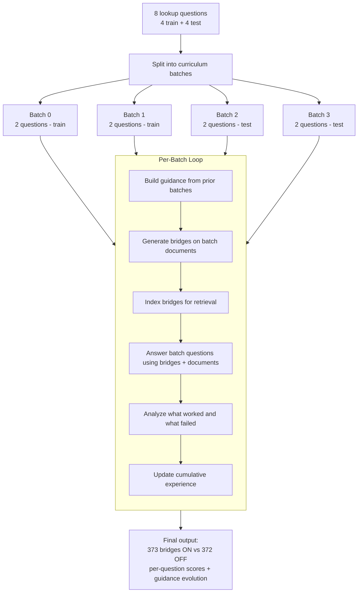
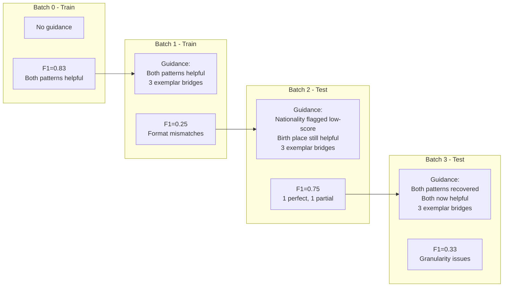
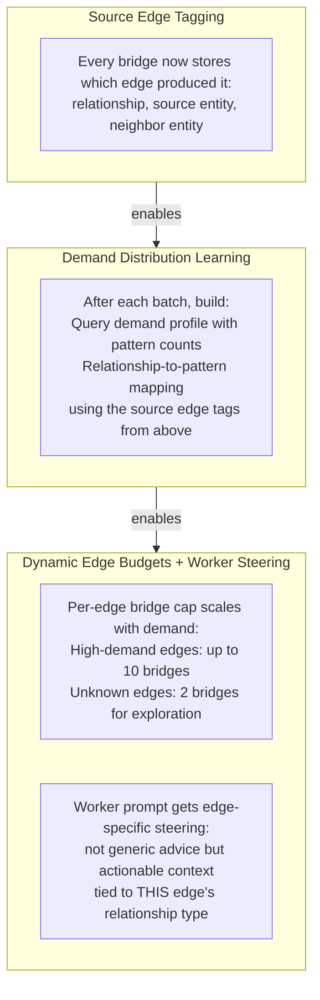

# Guidance Ablation Study

> This document traces a controlled ablation experiment testing whether curriculum guidance improves bridge generation: **8 pure lookup questions, 4 curriculum batches, guidance ON vs OFF, using the 2WikiMultiHopQA dataset.** Result: guidance had zero measurable effect.

---

## What We Tested

The curriculum pipeline injects guidance into worker prompts — demand sketches, feedback briefs, and bridge exemplars from prior batches. The question is: does this guidance actually improve bridge quality and answer accuracy, or would the worker produce equally good bridges without it?

To isolate the effect, we selected 8 questions from two question families (director birth place and director nationality), split them into 4 train and 4 test, and ran the full curriculum pipeline twice — once with guidance enabled, once disabled. Everything else was identical: same model, same documents, same pipeline mode, same verifier settings.

All 8 questions are **pure lookups** — no comparisons, no boolean questions, no temporal reasoning. Each asks a single factual property that requires chaining two documents (film document + director document).

---

## Pipeline Overview

The experiment runs this loop **twice** — once with guidance flowing between batches, once without. In the guidance-off condition, step 1 produces an empty payload and the worker receives no demand/feedback information.

---

## Step 1: Splitting Questions into Batches

Each batch contains one question from each family (one birth place, one nationality). Train batches (0-1) build the guidance signal. Test batches (2-3) evaluate whether that signal helped.

| Batch | Questions | Split | Role |
| ----- | --------- | ----- | ---- |
| 0 | 2 (Gaby birth place + Blood Street nationality) | Train | Seed -- no guidance for either condition |
| 1 | 2 (Swamp Thing birth place + Good People nationality) | Train | Guidance ON receives batch 0 feedback |
| 2 | 2 (Peter's Friends birth place + Overland Adventure nationality) | Test | Guidance ON receives batches 0-1 feedback |
| 3 | 2 (Lonesome Pine birth place + 3096 Days nationality) | Test | Guidance ON receives batches 0-2 feedback |

---

## Step 2: How Bridges Are Generated

Identical to the main curriculum pipeline. For each batch, the system collects documents associated with the batch's questions and runs the RLM pipeline — walking the entity graph, packaging evidence into edge packets, sending them to a worker LLM, and verifying candidates.

The only difference between conditions: in guidance ON, the worker prompt includes a curriculum guidance block before the evidence packet. In guidance OFF, it does not.

### Where Curriculum Guidance Enters (Guidance ON Only)

When guidance is available (batches 1+), it is injected directly into the worker LLM's prompt before the evidence packet. The guidance tells the worker:

- **What question patterns are in high demand** -- e.g., "users ask about birth places and nationality"
- **What patterns are working** -- e.g., "birth_place.lookup.place is bridge-helpful"
- **What patterns are failing** -- e.g., "director_nationality scored F1=0.0"
- **What good bridges look like** -- concrete exemplar bridges from prior batches

---

## Step 3: Indexing Bridges for Retrieval

Both conditions index bridges the same way — BM25 + embedding similarity over forward and reverse bridge surfaces. Each bridge is classified into a question pattern with relation label, operation, answer type, domain, and comparison target.

### Bridge Generation Comparison

| Batch | Guidance ON | Guidance OFF | Questions |
| ----- | ----------- | ------------ | --------- |
| 0 | 56 bridges | 62 bridges | Gaby birth place + Blood Street nationality |
| 1 | 94 bridges | 86 bridges | Swamp Thing birth place + Good People nationality |
| 2 | 83 bridges | 88 bridges | Peter's Friends birth place + Overland Adventure nationality |
| 3 | 140 bridges | 136 bridges | Lonesome Pine birth place + 3096 Days nationality |
| **Total** | **373** | **372** | |

Bridge counts are nearly identical across all batches. Guidance did not make generation more selective or more efficient.

---

## Step 4: Answering Questions with Bridges

Same retrieval pipeline as the main curriculum run. For each question, the system searches the bridge registry (BM25 + semantic), searches raw document evidence, merges and re-ranks by embedding similarity, sends top evidence to the LLM, and scores the predicted answer against the gold answer.

### Concrete Example: Successful Bridge Retrieval

**Question:** *"What nationality is the director of film Overland Adventure?"* | **Gold answer:** "Australian"

The bridge registry contained a near-exact match:

| Rank | Evidence | Similarity |
| ---- | -------- | ---------- |
| 1 | Bridge: *"What is the nationality of the director of Overland Adventure? A: Australian"* | 0.908 |
| 2 | Bridge: *"Who is known as the director of Overland Adventure?"* | 0.763 |
| 3 | Bridge: *"When was the director of Overland Adventure born?"* | 0.758 |

**Result: F1 = 1.0, Exact Match = 1.0** — identical for both conditions.

### Concrete Example: Answer Granularity Failure

**Question:** *"What is the place of birth of the director of film Peter's Friends?"* | **Gold answer:** "Belfast"

| Rank | Evidence | Similarity |
| ---- | -------- | ---------- |
| 1 | Bridge: *"When was the director of Peter's Friends born?"* | 0.856 |
| 2 | Bridge: *"What is the nationality of the director of Peter's Friends?"* | 0.836 |

The LLM responded: *"Belfast, Northern Ireland."* — correct city, but the extra detail "Northern Ireland" reduced token-level F1.

**Result: F1 = 0.5** — identical for both conditions. The bridge retrieved the right fact; the issue is answer specificity.

---

## Step 5: Building the Feedback Brief (Guidance ON Only)

After each batch, the guidance-on condition builds a feedback brief categorizing each question's pattern:

### Batch 0 Feedback (First Signal)

| Question | Pattern | F1 | Category |
| -------- | ------- | -- | -------- |
| *"Place of birth of director of Gaby?"* | `birth_place.lookup.place` | 1.0 | **Bridge helpful** |
| *"Nationality of director of Blood Street?"* | `director_nationality.lookup.region` | 0.67 | **Bridge helpful** |

Both patterns marked as bridge-helpful. The feedback tells batch 1's workers: "birth place and nationality lookups are working — keep generating those."

### Batch 1 Feedback

| Question | Pattern | F1 | Category |
| -------- | ------- | -- | -------- |
| *"Place of birth of director of Swamp Thing?"* | `place_of_birth.lookup.place` | 0.5 | **Bridge helpful** |
| *"Nationality of director of Good People?"* | `director_nationality.lookup.other` | 0.0 | **Low score** |

The nationality pattern is flagged as low-score (F1=0.0 because "Danish" didn't match gold "Denmark"). The demand sketch now has 4 patterns accumulated.

### Batch 2 Feedback

| Question | Pattern | F1 | Category |
| -------- | ------- | -- | -------- |
| *"Place of birth of director of Peter's Friends?"* | `place_of_birth.lookup.place` | 0.5 | **Bridge helpful** |
| *"Nationality of director of Overland Adventure?"* | `director_nationality.lookup.other` | 1.0 | **Bridge helpful** |

The nationality pattern recovers — now marked as bridge-helpful after Overland Adventure succeeds.

---

## Step 6: Accumulating Experience and Selecting Exemplars (Guidance ON Only)

The experience state grew across batches:

| After Batch | Total Questions | Patterns Seen | Bridge-Helpful Patterns | Low-Score Patterns |
| ----------- | --------------- | ------------- | ----------------------- | ------------------ |
| 0 | 2 | 2 | 2 (birth_place, nationality) | 0 |
| 1 | 4 | 4 | 3 (added place_of_birth) | 1 (nationality.lookup.other) |
| 2 | 6 | 4 | 4 (nationality recovered) | 0 |
| 3 | 8 | 4 | 4 | 0 |

Each batch after 0 selected 3 bridge exemplars from the registry, weighted toward patterns that needed improvement (2x for low-score, 1.5x for doc-dominant). Despite this progressively richer guidance, the worker generated essentially the same bridges as the no-guidance condition.

---

## Batch-by-Batch Trace

### Batch 0 -- Seed (No Guidance for Either Condition)

Both conditions run identically — no prior feedback exists.

**Questions and outcomes (identical for both conditions):**

| Question | Pattern | F1 | What happened |
| -------- | ------- | -- | ------------- |
| *"Place of birth of the director of Gaby: A True Story?"* | Birth place lookup | **1.0** | Bridge directly connected film to director to birthplace. Predicted "Mexico City" matched gold exactly. |
| *"Nationality of the director of Blood Street?"* | Nationality lookup | **0.67** | Bridge retrieved the director (Leo Fong) but the GSW encoded his nationality as "Chinese American" while gold expected just "Chinese." Partial match. |

> **Batch 0 metrics: F1 = 0.83, EM = 0.5**

---

### Batch 1 -- Guided by Batch 0 (Guidance ON Only)

The guidance-on condition receives feedback from batch 0: both patterns marked bridge-helpful, 3 exemplar bridges shown. The guidance-off condition receives nothing.

**Guidance highlights (ON condition):**
- Demand sketch: `birth_place.lookup.place` x1, `director_nationality.lookup.region` x1
- Both marked bridge-helpful
- 3 exemplar bridges from batch 0

**Questions and outcomes (identical for both conditions):**

| Question | Pattern | F1 | What happened |
| -------- | ------- | -- | ------------- |
| *"Place of birth of the director of Return Of Swamp Thing?"* | Birth place lookup | **0.5** | Bridge found the director's birthplace but at city-level granularity: "Glen Cove, Long Island, New York" vs gold "New York." Too specific. |
| *"Nationality of the director of Good People?"* | Nationality lookup | **0.0** | Bridge correctly identified the director as "Danish" but gold expected the country name "Denmark." Adjective vs noun mismatch. |

> **Batch 1 metrics: F1 = 0.25, EM = 0.0**

> [!tip] Key observation
> Despite receiving guidance with two bridge-helpful patterns and 3 exemplars, the guidance-on condition produced **identical predictions** to guidance-off. The worker already generates birth place and nationality bridges naturally from film-director edges — the guidance added no new signal.

---

### Batch 2 -- Test (Guided by Batches 0-1)

The guidance-on condition now has accumulated feedback from 4 train questions. The nationality pattern was flagged as low-score after batch 1.

**Guidance highlights (ON condition):**
- Demand sketch: 4 patterns accumulated
- Low score: `director_nationality.lookup.other` flagged (avg_score=0.0)
- Bridge-helpful: `place_of_birth.lookup.place` x1
- 3 exemplar bridges shown

**Questions and outcomes (identical for both conditions):**

| Question | Pattern | F1 | What happened |
| -------- | ------- | -- | ------------- |
| *"Place of birth of the director of Peter's Friends?"* | Birth place lookup | **0.5** | Bridge with 0.856 similarity retrieved correctly. Predicted "Belfast, Northern Ireland" vs gold "Belfast." Correct city, too specific. |
| *"Nationality of the director of Overland Adventure?"* | Nationality lookup | **1.0** | Bridge with 0.908 similarity directly provided the answer. Predicted "Australian" matched gold exactly. |

> **Batch 2 metrics: F1 = 0.75, EM = 0.5**

---

### Batch 3 -- Test (Guided by Batches 0-2)

The guidance-on condition now has accumulated feedback from 6 questions. Both patterns are now bridge-helpful.

**Guidance highlights (ON condition):**
- Demand sketch: `director_nationality.lookup.other` x2, `place_of_birth.lookup.place` x2
- Both patterns now marked bridge-helpful (nationality recovered after Overland Adventure)
- 3 exemplar bridges shown

**Questions and outcomes (identical for both conditions):**

| Question | Pattern | F1 | What happened |
| -------- | ------- | -- | ------------- |
| *"Place of birth of the director of The Trail Of The Lonesome Pine?"* | Birth place lookup | **0.67** | Bridge with 0.939 similarity retrieved correctly. Predicted "Richmond, Virginia" vs gold "Richmond." Correct city, extra state detail. |
| *"Nationality of the director of 3096 Days?"* | Nationality lookup | **0.0** | Bridge with 0.985 similarity — nearly perfect query match. But the GSW encoded the director as "German-American" while gold expected "American." Dual nationality vs single nationality mismatch. |

> **Batch 3 metrics: F1 = 0.33, EM = 0.0**

---

## Results Summary

### Overall Test Metrics (Batches 2-3)

| Metric | Guidance ON | Guidance OFF |
| ------ | ----------- | ------------ |
| Exact Match | 0.25 | 0.25 |
| F1 | 0.5417 | 0.5417 |
| Bridge usage rate | 100% | 100% |
| Total bridges generated | 373 | 372 |

Both conditions produced identical predictions for all 4 test questions.

### All 8 Questions at a Glance

| Batch | Split | Question | Gold | Predicted (both) | F1 |
| ----- | ----- | -------- | ---- | ----------------- | -- |
| 0 | Train | *"Birth place of director of Gaby?"* | Mexico City | "Mexico City." | **1.0** |
| 0 | Train | *"Nationality of director of Blood Street?"* | Chinese | "Chinese American." | **0.67** |
| 1 | Train | *"Birth place of director of Swamp Thing?"* | New York | "Glen Cove, Long Island, New York." | **0.5** |
| 1 | Train | *"Nationality of director of Good People?"* | Denmark | "Danish." | **0.0** |
| 2 | Test | *"Birth place of director of Peter's Friends?"* | Belfast | "Belfast, Northern Ireland." | **0.5** |
| 2 | Test | *"Nationality of director of Overland Adventure?"* | Australian | "Australian." | **1.0** |
| 3 | Test | *"Birth place of director of Lonesome Pine?"* | Richmond | "Richmond, Virginia." | **0.67** |
| 3 | Test | *"Nationality of director of 3096 Days?"* | American | "German-American." | **0.0** |

---

## How the Feedback Loop Evolves (Guidance ON)

The guidance tracked patterns correctly — flagging nationality as low-score when it failed, marking it as recovered when it succeeded. But this tracking had **no effect on what the worker actually generated.** The guidance-off condition produced the same bridges and the same answers.

---

## Why Guidance Had No Effect

The guidance tells workers: "users ask about birth places and nationality — focus on those." But for pure lookup questions, the entity graph **already produces the right bridges without being told.**

When the worker sees an edge connecting a film entity to a director entity, it naturally generates:
- "Where was the director of [Film] born?"
- "What nationality is the director of [Film]?"
- "When was the director of [Film] born?"

These are the **obvious two-hop chains** from the evidence. The guidance is telling the worker to do what it would do anyway. There is no mismatch between what the worker naturally generates and what users ask.

Guidance would potentially add value when:
- The worker faces many possible bridge types for an edge and needs to prioritize
- The question patterns are surprising or non-obvious
- The worker is generating the wrong type of bridge and needs correction

None of these conditions hold for simple film-director lookup chains.

---

## Failure Mode Analysis

All 8 questions retrieved highly relevant bridges (similarity 0.85-0.99). Every failure was an **answer granularity mismatch** — the system retrieved the right fact but expressed it at a different level of specificity than the gold answer expected.

| Failure Type | Questions Affected | Example |
| ------------ | ------------------ | ------- |
| **Too specific** | Peter's Friends, Lonesome Pine, Swamp Thing | "Belfast, Northern Ireland" vs gold "Belfast" |
| **Adjective vs noun** | Good People | "Danish" vs gold "Denmark" |
| **Dual vs single nationality** | Blood Street, 3096 Days | "Chinese American" / "German-American" vs gold "Chinese" / "American" |

> [!warning] These are not bridge problems
> The bridges retrieved the correct facts with high similarity (0.85-0.99). The failure is in the **answer extraction step** — the LLM includes more detail than the gold answer expects. Fixing this would require changes to the answer prompt or post-processing, not to bridge generation or guidance.

---

## Limitations

This ablation tested only **pure lookup questions** — questions where the answer is a single fact reachable through a two-hop chain (Film -> Director -> Property). The findings that guidance has no effect apply specifically to this question type.

The experiment does **not** test:
- **Comparison questions** ("Which film's director was born first?")
- **Boolean questions** ("Do both films have directors from the same country?")
- **Temporal reasoning** ("Which was released first?")

For these more complex question types, guidance might provide genuine value by steering the worker toward non-obvious bridge formulations. However, these question types face a more fundamental architectural constraint: the worker only sees one entity-neighbor edge at a time and cannot generate bridges that compare two independent entities.

---

## Next Steps: Demand-Aware Bridge Generation

This ablation exposed two problems beyond guidance effectiveness. We diagnosed them and built a three-part solution.

### What We Found

| Problem | Evidence | Impact |
| ------- | -------- | ------ |
| No quality differentiation | All 606 bridges had confidence = 0.9 (hardcoded default). Verifier computed real scores but code discarded them. | Retrieval can't distinguish useful bridges from marginal ones |
| 92% bridge waste | Only 48/606 bridges ever retrieved, only 35 kept. 354 pattern types generated, only 25 ever helpful. | Supply-driven generation: enumerate edges, generate whatever is possible |

The root cause of the waste: the system walks every edge blindly and generates whatever two-hop chains it finds, with no signal about which relationship types have historically produced bridges matching what users ask. It couldn't learn this because bridges carried no record of which edge produced them.

### What We Built

Three mechanisms that chain together — each enabling the next:

**Source edge tagging** gives each bridge provenance — which GSW verb phrase produced it. **Demand distribution learning** uses those tags to discover which relationship types produce bridges matching what users ask. **Dynamic edge budgets** use that mapping to invest generation effort where it matters and steer workers with actionable, edge-specific context.

### How It Learns Across Batches

| Batch | What Happens |
| ----- | ------------ |
| **0** | No demand signal. Every edge gets base budget (2 bridges). Worker generates freely. All bridges tagged with source relationship. Verifier scores each bridge on real quality. |
| **1** | Demand from batch 0 questions steers generation. Edges matching demanded patterns get higher budgets + targeted steering. Unproductive edges get minimum budget. Unseen edges still explored. |
| **N** | Demand profile grown across N batches. System knows which relationship types produce which query patterns. Generation increasingly focused, exploration always preserved. |

### How the Worker Prompt Changes

**Before (generic guidance that had no effect):**

> Curriculum guidance (advisory only):
> High demand: place_of_birth.lookup.place x1
> Bridge-helpful: place_of_birth.lookup.place x1

**After (edge-specific demand context):**

> Edge relationship: 'directed by'
> This relationship has produced bridges matching 3 demanded query types:
> - director_nationality.lookup.region x4 [BRIDGE HELPFUL]
>   Example query: "What nationality is the director of film X?"
> - place_of_birth.lookup.place x3
>   Example query: "What is the place of birth of the director of film Y?"
> - director_birth.lookup.date x2 [NEEDS IMPROVEMENT]
>   Example query: "When was the director of film Z born?"
> Prioritize generating bridges matching these query types.

The difference: the old guidance told the worker *in general* what patterns mattered. The new context tells the worker *for this specific edge* what it has produced before and what users are asking. For edges with unseen relationship types, the worker is told to explore freely.

### Why This Should Succeed Where Generic Guidance Failed

| Generic Guidance (failed) | Demand-Aware (new) |
| ------------------------- | ------------------ |
| Tells worker "nationality is demanded" | Controls how many bridges each edge produces based on track record |
| Worker already generates nationality bridges naturally | Budget allocation means high-demand edges get 5x more bridges than low-demand |
| Same advice for every edge | Each edge gets context specific to its relationship type |
| No structural-to-semantic mapping | Learns that "directed by" edges → director_nationality queries |

### What Remains Unsolved

| Problem | Why It's Hard |
| ------- | ------------- |
| **Comparison questions** | Edge-walk processes one entity-neighbor pair at a time. Can't generate "Which director was born first, X or Y?" — would need a post-hoc synthesis pass pairing individual fact bridges into comparison questions. |
| **Answer granularity** | Every failure in this ablation was a correct fact at the wrong specificity ("Belfast, Northern Ireland" vs gold "Belfast"). Not a bridge problem — requires changes to answer extraction or post-processing. |
