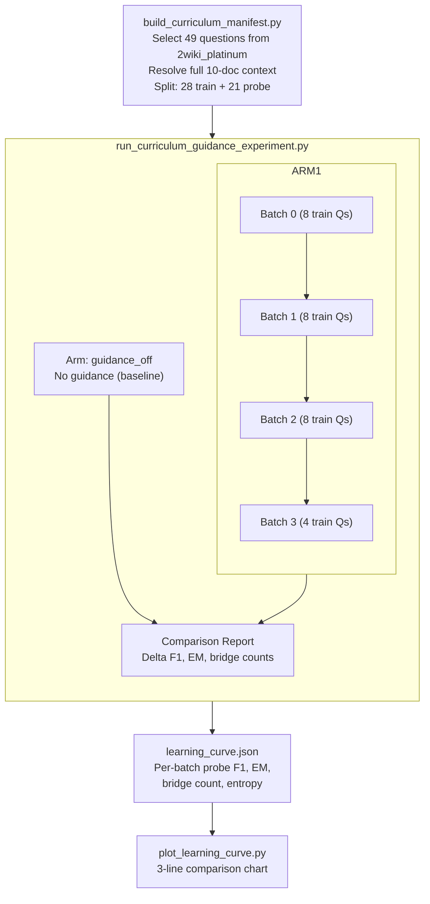
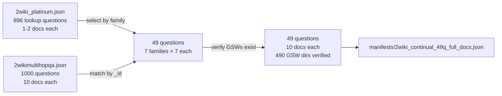
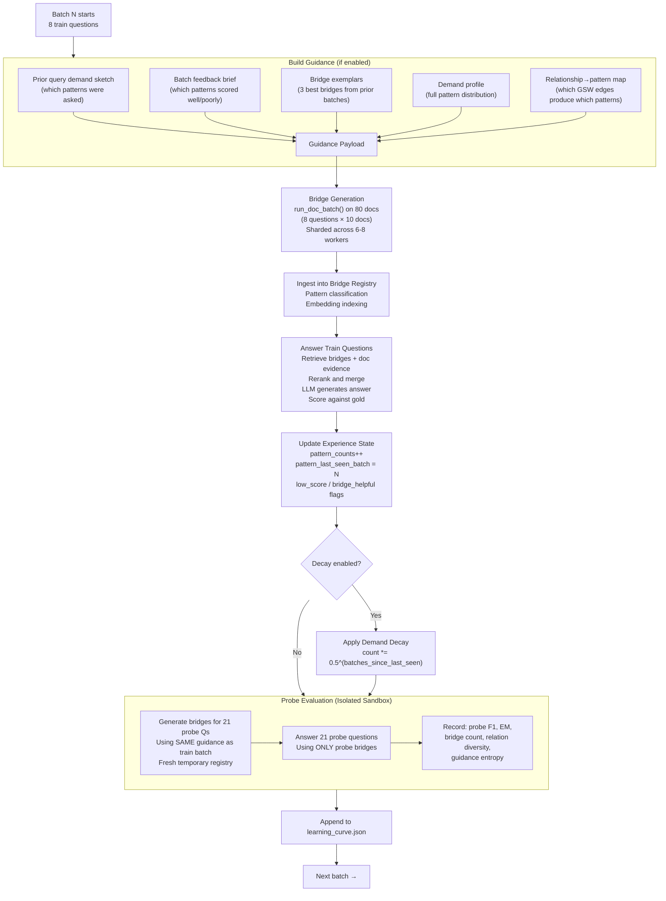
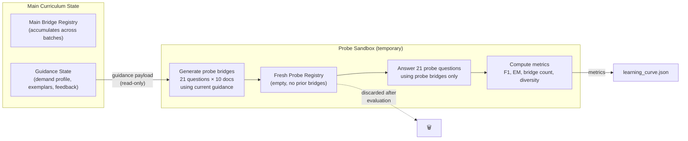

# Probing Continual Learning Experiment

> This document explains our **probe-based continual learning experiment** for evaluating whether curriculum guidance improves bridge generation quality over batches. The experiment uses a fixed set of 21 probe questions evaluated after every batch to produce a learning curve — the same questions, fresh bridges each time, only the guidance state changes.

---

## What Problem Are We Solving?

Curriculum guidance claims to learn from prior batches and improve bridge generation for future batches. But does it actually help? Our initial 44Q ablation showed guidance had **zero effect on 87.5% of test questions** and actively hurt 2 questions. The problem: we could only see the final score, not how guidance evolved batch by batch.

We need a controlled experiment that answers:
- Does probe F1 improve as guidance accumulates? (**continual learning**)
- Does guidance produce fewer bridges over time? (**over-pruning**)
- Does the demand distribution collapse? (**overfitting**)
- Is the guidance signal even useful, or just noise?

The key insight: we can't evaluate test questions from future batches because their bridges don't exist yet. Instead, we use a **fixed probe set** — the same 21 questions evaluated after every batch with fresh bridges. Any change in probe performance is purely from the guidance signal.

---

## Experiment Design Overview



---

## Dataset Construction

The dataset is built in two stages: **select** questions from the curated platinum set, then **resolve** their full document context from the original dataset.



**Why two datasets?** The platinum set has curated, high-quality questions but stripped context (1-2 docs). The original dataset has full 10-doc context (supporting + distractor paragraphs). We select from platinum for quality, then resolve full context for bridge generation.

**GSW verification:** Each document's GSW directory is checked on disk at the specified `--gsw_path`. Questions with missing GSWs are skipped.

**Family classification:** Questions are classified into 7 relation families:

| Family | Example question | Count |
| --- | --- | ---: |
| `birth_place` | Where was the director of film The Outlaw Express born? | 7 |
| `death_place` | Where did the composer of film The Straw Hat die? | 7 |
| `maternal_parent` | Who is the maternal grandmother of Eleanor of Brittany? | 7 |
| `nationality` | What nationality is the director of film Blood Street? | 7 |
| `other` | Who is Eustace III's uncle? | 7 |
| `paternal_parent` | Who is the father-in-law of Ermengarde of Hesbaye? | 7 |
| `spouse` | Who is the spouse of the director of film My Three Merry Widows? | 7 |

---

## The Two Splits

| | **Train** | **Probe** |
| --- | --- | --- |
| **Size** | 28 questions (4 per family) | 21 questions (3 per family) |
| **Purpose** | Drive curriculum learning — bridges generated, answers scored, feedback updates guidance | Fixed evaluation — same questions re-evaluated after every batch |
| **When evaluated** | Once, when its batch runs | After **every** batch (4 times total) |
| **Feeds guidance?** | **Yes** — results update demand profile, exemplar selection, feedback brief | **No** — completely isolated sandbox |
| **Bridges persist?** | **Yes** — added to main registry, accumulate across batches | **No** — temporary registry, discarded after each evaluation |

> [!note] Why no test set?
> The probe set IS the evaluation. The last batch's probe score is the final metric. A separate test set would only be evaluated once (at the end), giving no learning curve. The probe gives us 4 data points showing how performance evolves.

---

## The Batch Loop

Each batch processes 8 train questions through this pipeline:



---

## Probe Evaluation (Isolated Sandbox)

The probe evaluation is the core measurement mechanism. It answers: **given the current guidance state, how well does the system generate bridges for unseen questions?**



> [!important] Why isolated?
> Probe bridges are generated in a temporary registry and discarded after evaluation. They never enter the main registry and never affect future guidance. This ensures the probe measures **generalization** — what the current guidance produces on fresh documents — not memorization from accumulated bridges.

**Per-question probe table** (printed to console after each batch):

| Family | Question | F1 | EM | Predicted |
| --- | --- | ---: | --- | --- |
| `birth_place` | Where was the director of The Outlaw Express born? | 0.80 | ✗ | Santa Rosa, California |
| `spouse` | Who is the spouse of the director of... | 0.00 | ✗ | Maria del Pilar Cordero |
| `paternal_parent` | Who is the father-in-law of Ermengarde? | 1.00 | ✓ | Charlemagne |

---

## What We Measure

After each batch, the learning curve records:

| Metric | What it shows | Healthy signal | Overfitting signal |
| --- | --- | --- | --- |
| **Probe F1** | Answer quality on fixed questions | Improves over batches | Degrades over batches |
| **Probe EM** | Exact match on fixed questions | Improves | Degrades |
| **Probe bridges generated** | How many bridges the system creates | Stable (~170-180) | Decreasing (174→147) |
| **Probe relation diversity** | Unique relation types in bridges | Stable or increasing | Decreasing |
| **Guidance entropy** | Demand distribution diversity | Gentle decrease (focusing) | Collapse to 0 (one pattern dominates) |
| **Main bridges this batch** | Train batch bridge output | Stable per batch | Decreasing over batches |
| **Main bridges cumulative** | Total registry growth | Growing | Plateauing early |

> [!tip] The key overfitting signal
> If `probe bridges generated` decreases monotonically AND `probe F1` doesn't improve, guidance is **over-pruning** — generating fewer bridges without improving quality. This is the pattern we observed in the first 49Q experiment.

---

## Comparison Arms

| Arm | Guidance? | Decay? | What it tests |
| --- | --- | --- | --- |
| `guidance_on` | Full curriculum guidance | No | Does guidance improve bridge generation? |
| `guidance_off` | None | No | Baseline — probe F1 should be stable across batches |
| `guidance_decay` | With exponential decay | Yes (rate=0.5) | Does decaying old patterns prevent overfitting? |

The `guidance_decay` arm applies `count *= 0.5^(batches_since_last_seen)` after each batch's experience update. This ensures old patterns fade, preventing early-batch patterns from dominating the demand profile.

---

## Expected vs Actual Outcomes

### First run (49Q, single-doc problem)

The first experiment used `2wiki_platinum.json` directly, which had only **1-2 context docs per question**. The bridge system requires ≥2 docs for cross-document bridges. Result: 47% of questions couldn't have bridges generated at all.

| Signal | Expected | Observed |
| --- | --- | --- |
| Probe F1 with guidance | Improves | Volatile (0.73→0.57→0.79→0.73) |
| Probe F1 without guidance | Flat | Also volatile (0.67→0.71→0.68→0.79) |
| Entropy | Collapses (overfitting) | Grew from 0→4.42 (diversifying) |
| Bridge count | Decreases (over-pruning) | Mild decrease (174→147, -15%) |

> [!warning] Dataset issue discovered
> The single-doc problem made the results unreliable. Questions with 1 doc couldn't generate bridges, so both arms relied on latent LLM knowledge. The learning curve was measuring noise, not guidance quality.

### Second run (49Q, full 10-doc context)

Fixed by resolving full 10-doc context from `2wikimultihopqa.json`. All 490 GSW directories verified on disk. Every question can now generate cross-document bridges.

*(Results to be added after experiment completes.)*

---

## Lessons Learned

1. **Dataset matters more than algorithm.** The single-doc vs 10-doc difference completely changed whether the experiment could measure anything useful. Always verify document counts before running.

2. **Per-question paired comparison > aggregate F1.** With 21 probe questions, aggregate F1 has high variance. Paired comparison (same question, both arms) revealed that 79% of questions had identical F1 — guidance had zero effect on most questions.

3. **Entropy is not the overfitting signal we expected.** Guidance entropy grew (diversified) rather than collapsed. The demand profile gets broader, not narrower. The real issue was guidance changing evidence ranking for specific families (spouse, nationality).

4. **Bridge transfer across questions doesn't happen.** Each question has isolated documents with unique entities. Bridges from "Lothair II" docs can't help "Romanoff and Juliet" probe questions. The only transfer is the guidance signal itself.

5. **Open-source model compatibility requires testing.** gpt-oss-120b via vLLM needed fixes for structured output (`json_object` fallback) and `reasoning_effort` parameter stripping. The pipeline was designed for Bedrock/OpenAI APIs.

---

## Running the Experiment

### Step 1: Build the manifest

```bash
python playground/sleep_time/build_curriculum_manifest.py \
    --dataset playground_data/2wiki_platinum.json \
    --full_dataset playground_data/2wikimultihopqa.json \
    --corpus_path playground_data/2wikimultihopqa_corpus.json \
    --gsw_path /mnt/SSD1/shreyas/SM_GSW/2wiki/networks \
    --num_per_family 7 --probe_per_family 3 --batch_size 8 \
    --output manifests/2wiki_continual_49q_full_docs.json
```

### Step 2: Run the experiment (2 arms)

```bash
python playground/sleep_time/run_curriculum_guidance_experiment.py \
    --manifest manifests/2wiki_continual_49q_full_docs.json \
    --output_root logs/experiments/2wiki_continual_49q_full_docs \
    --gsw_path /mnt/SSD1/shreyas/SM_GSW/2wiki/networks \
    --model bedrock/openai.gpt-oss-120b-1:0 \
    --root_model bedrock/openai.gpt-oss-120b-1:0 \
    --worker_model bedrock/openai.gpt-oss-120b-1:0 \
    --pipeline_mode hybrid --hybrid_scope doc_edge \
    --edge_max_depth 3 --edge_max_calls 5 --edge_max_tokens 12000 \
    --max_tokens 5000000 \
    --edge_parallel_enabled --edge_parallel_workers 4 \
    --bridge_query_top_k 5 --bridge_prompt_exemplar_top_k 3 \
    --curriculum_batch_size 8 --curriculum_seed_batch_size 8 \
    --curriculum_generation_parallel_enabled \
    --curriculum_generation_parallel_workers 6 \
    --probe_eval \
    --show-thinking
```

### Step 3: Plot learning curves

```bash
python playground/sleep_time/plot_learning_curve.py \
    --experiment_dir logs/experiments/2wiki_continual_49q_full_docs \
    --output learning_curves.png
```

---

## Output Files

| Path | Contents |
| --- | --- |
| `{arm}/learning_curve.json` | Per-batch probe metrics with per-question details |
| `{arm}/bridge_test_results.json` | Final train results, bridge registry summary |
| `{arm}/batch_N/query_answer_results.json` | Per-question train results for batch N |
| `{arm}/batch_N/bridge_registry_snapshot.json` | Bridge classification report for batch N |
| `{arm}/batch_N/generation_shards/` | Per-shard bridge generation results |
| `{arm}/probe_batch_N/query_answer_results.json` | Per-question probe results for batch N |
| `{arm}/probe_batch_N/generation_shards/` | Probe bridge generation shards |
| `{arm}/probe_progress.json` | Live probe evaluation status (polled by experiment runner) |
| `comparison.json` | Side-by-side arm comparison with delta metrics |
| `resolved_manifest.json` | Manifest with resolved question metadata |
| `learning_curves.png` | Visualization of probe F1, bridges, entropy over batches |

---

## Key Scripts

| Script | Purpose |
| --- | --- |
| `playground/sleep_time/build_curriculum_manifest.py` | Build manifest with train/probe splits from platinum + full dataset |
| `playground/sleep_time/run_curriculum_guidance_experiment.py` | Orchestrate multi-arm experiment with progress polling |
| `playground/sleep_time/run_bridge_test.py` | Core curriculum loop with probe evaluation |
| `src/gsw_memory/sleep_time/curriculum.py` | Guidance payload building, entropy, decay, experience state |
| `playground/sleep_time/plot_learning_curve.py` | Visualization of learning curves across arms |
