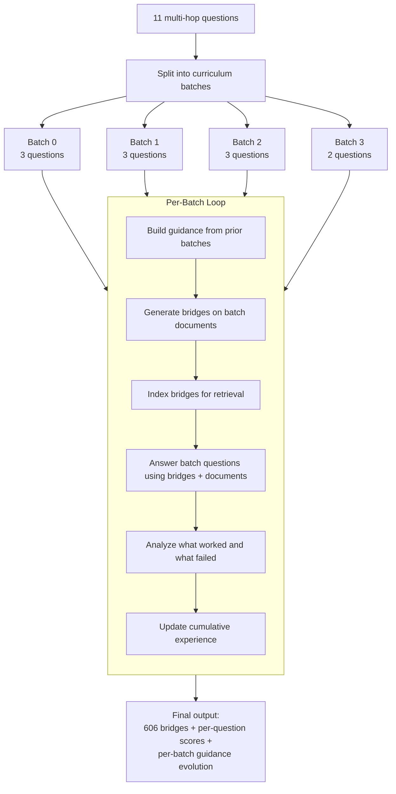
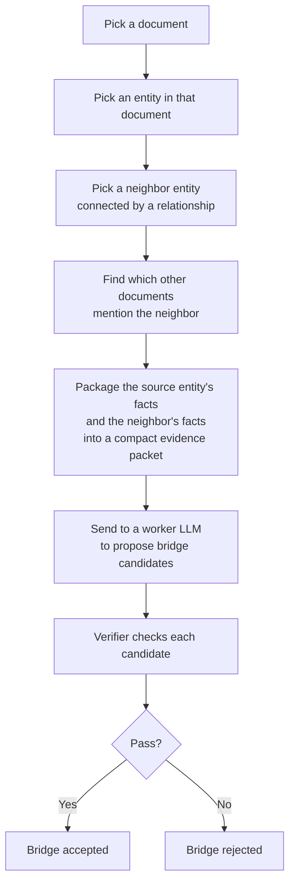
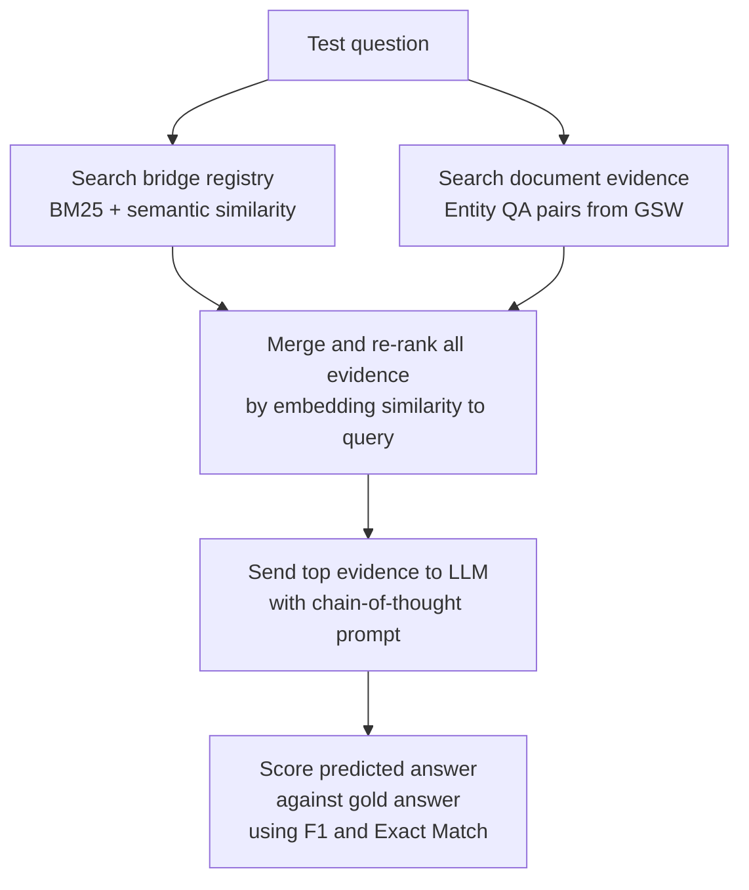
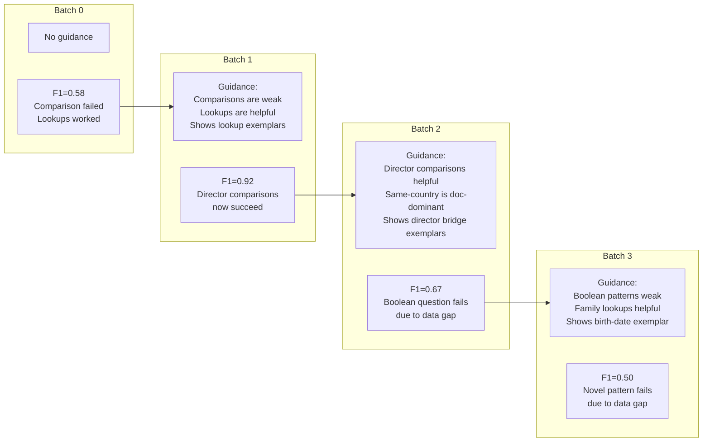

# Sleep-Time Curriculum Pipeline

> This document walks through our curriculum-guided bridge generation pipeline using a real experimental run: **11 multi-hop questions, 4 curriculum batches, 606 bridges generated**.

---

## What Problem Are We Solving?

Our system processes documents into structured knowledge graphs called **GSWs** (Generative Semantic Workspaces). Each document becomes a graph of entities, relationships, and pre-computed QA pairs. The challenge is: when a user asks a question that requires combining facts from **multiple documents**, the system needs pre-built reasoning chains that connect those documents.

We call these reasoning chains **bridge QA pairs**. A bridge is a two-hop question that can only be answered by chaining a fact from one document with a fact from another. For example:

> **Forward:** *"When did Lothair II's mother die?"*
> - Hop 1: Lothair II's mother is Ermengarde (from document about Lothair II)
> - Hop 2: Ermengarde died on 20 March 851 (from document about Ermengarde)
> - **Answer: 20 March 851**
>
> **Reverse:** *"Whose mother died on 20 March 851?"*
> - The same chain traversed backwards
> - **Answer: Lothair II**

Every bridge must have both a forward and reverse form. The reverse proves that the chain is a genuine multi-hop connection, not just a single-fact lookup in disguise.

The naive approach is to generate bridges blindly across the entire corpus. But this wastes effort -- the system produces many bridges for patterns nobody asks about, while missing the patterns that actually matter. **Curriculum mode** solves this by adding a feedback loop: generate bridges, test them against real questions, learn which patterns succeed or fail, and use that signal to guide the next round of generation.

---

## Pipeline Overview

The key idea: **Batch 0 explores blindly. Every subsequent batch is shaped by the successes and failures of all prior batches.**

---

## Step 1: Splitting Questions into Batches

The 11 test questions are divided into sequential batches. The first batch (the "seed" batch) runs without any guidance -- it establishes a baseline. Each subsequent batch receives progressively richer guidance built from all prior batches.

| Batch | Questions | Role |
| ----- | --------- | ---- |
| 0     | 3         | Seed batch -- explores blind, no guidance |
| 1     | 3         | Guided by what we learned from batch 0 |
| 2     | 3         | Guided by what we learned from batches 0 and 1 |
| 3     | 2         | Guided by what we learned from batches 0, 1, and 2 |

---

## Step 2: How Bridges Are Generated

For each batch, we collect all the documents associated with that batch's questions and run the **RLM (Recursive Local Model) pipeline** over them. This pipeline works by systematically walking the entity graph:

The worker LLM receives a compact packet containing the source entity's QA pairs and the neighbor entity's QA pairs from their respective documents. It proposes bridge candidates -- two-hop questions that chain facts across these documents.

Each candidate then goes through a **verifier** that checks:

- Does it genuinely require two documents? (not a single-doc fact)
- Is the reverse question a true inversion of the forward? (not an independent question)
- Is it non-circular? (forward and reverse are not the same question)
- Does the answer not appear in the question? (no answer leakage)
- Is it sufficiently different from already-accepted bridges? (no near-duplicates)

Only candidates that pass all checks are accepted into the bridge store.

### Where Curriculum Guidance Enters

When guidance is available (batches 1+), it is injected directly into the worker LLM's prompt before the evidence packet. The guidance tells the worker:

- **What question patterns are in high demand** -- e.g., "users frequently ask about death dates in the family domain"
- **What patterns are failing** -- e.g., "comparison questions about release dates scored F1=0.0"
- **What good bridges look like** -- concrete exemplar bridges from prior batches that were helpful

The guidance is framed as advisory: the worker should prefer generating bridges that match high-demand and weak-coverage patterns, but must stay grounded in the actual evidence rather than fabricating facts.

---

## Step 3: Indexing Bridges for Retrieval

After generation, all accepted bridges are added to a **Bridge Registry** -- a searchable index that grows across batches.

Each bridge creates two searchable entries (called "surfaces"):
- A **forward surface**: the forward question paired with its answer
- A **reverse surface**: the reverse question paired with its answer

These surfaces are indexed using both:
- **BM25** (keyword-based matching) -- good for exact term overlap
- **Embedding similarity** (semantic matching) -- good for paraphrases and related questions

### Question Pattern Classification

Every bridge question (and every test question) is also classified into a structured **question pattern** with five dimensions:

| Dimension | What it captures | Examples |
| --------- | --------------- | -------- |
| Relation label | The core relationship being asked about | `mother_death`, `director_birth`, `place_of_birth` |
| Operation | The type of reasoning required | lookup, compare, boolean, count |
| Answer type | What kind of entity the answer is | person, place, date, title |
| Domain | The topic area | family, film, history_politics, geography |
| Comparison target | For comparison questions, what's being compared | earlier, later, higher, lower |

These dimensions are combined into a **pattern key** like `mother_death.lookup.date` or `release_date.compare.earlier.title`. Pattern keys are the unit of analysis for the feedback loop -- they let us track which *types* of questions are well-served by bridges and which are not.

---

## Step 4: Answering Questions with Bridges

For each question in the batch, the system retrieves evidence from two sources and merges them:

**Re-ranking with protected bridge keep:** After merging bridge and document evidence, all items are re-scored by embedding similarity to the query. If a bridge has very high similarity (cosine >= 0.85), it is "protected" -- guaranteed to appear in the final evidence even if it would otherwise be pushed out by document evidence. This prevents near-exact bridge matches from being lost.

**Answer extraction:** The top evidence items are sent to an LLM using a chain-of-thought prompt. The model reasons through the evidence and produces a final answer, which is scored against the gold answer using token-level F1 and exact match.

### Concrete Example: Successful Bridge Retrieval

**Question:** *"When did Lothair II's mother die?"* | **Gold answer:** "20 March 851"

The bridge registry contained multiple bridges about Lothair II's family. The top retrieved evidence was entirely bridge-based:

| Rank | Evidence | Similarity |
| ---- | -------- | ---------- |
| 1 | Bridge: *"When did Lothair II's mother die? A: 20 March 851"* | 0.965 |
| 2 | Bridge: *"When did Lothair II's mother die? A: 20 March 851"* (different bridge, same content) | 0.965 |
| 3 | Bridge: *"When did the mother of Lothair II die? A: 20 March 851"* | 0.943 |

The LLM responded: *"The provided QA pairs consistently state that Lothair II's mother died on 20 March 851."*

**Result: F1 = 1.0, Exact Match = 1.0** -- bridges provided a direct, confident answer.

### Concrete Example: Bridge Retrieval Failure

**Question:** *"What nationality is the director of film Blood Street?"* | **Gold answer:** "Chinese"

No relevant bridges were retrieved. Document evidence identified Leo Fong as the director but the GSW did not encode his nationality. The LLM guessed "American" based on insufficient evidence.

**Result: F1 = 0.0** -- this failure is a GSW coverage gap, not a bridge retrieval failure.

---

## Step 5: Building the Feedback Brief

After answering all questions in a batch, the system analyzes the results to produce a **feedback brief**. Each question's pattern is categorized into one of four feedback buckets:

| Category | What it means | When it triggers |
| -------- | ------------- | ---------------- |
| **High demand** | This pattern type appears frequently in queries | Most common pattern keys in the batch |
| **Low score** | Bridges exist but are failing for this pattern | F1 score < 0.5 |
| **Doc dominant** | Documents answered the question, bridges did not contribute | Document evidence used, zero bridge evidence |
| **Bridge helpful** | Bridges actively contributed to a correct answer | Bridge evidence present AND F1 >= 0.5 |

The feedback brief also generates human-readable summary lines that are injected verbatim into the next batch's worker prompts. For example, from batch 0:

> *"High demand: mother_death.lookup.date x1, place_of_birth.lookup.place x1, release_date.compare.earlier.title x1"*
> *"Weak coverage: release_date.compare.earlier.title x1"*
> *"Bridge-helpful patterns: mother_death.lookup.date x1, place_of_birth.lookup.place x1"*

This tells the next batch's bridge workers: "death-date lookups and place-of-birth lookups are working well -- keep generating those. Film release date comparisons are failing -- try harder on comparison patterns."

---

## Step 6: Accumulating Experience and Selecting Exemplars

The feedback from each batch is accumulated into a **running experience state** that tracks all patterns seen across all prior batches, their frequencies, representative example questions, and which categories they fall into.

When building guidance for the next batch, the system also selects **bridge exemplars** -- concrete examples of previously generated bridges that were helpful. Exemplars are chosen using a weighted scoring system that prioritizes:

1. **Bridges matching low-score patterns** (2x weight) -- the highest priority, because these are the patterns where bridges are currently failing
2. **Bridges matching doc-dominant patterns** (1.5x weight) -- patterns where bridges aren't contributing at all
3. **Bridges matching bridge-helpful patterns** (0.75x weight) -- patterns that are already working, shown as positive examples
4. **Bridges matching high-demand patterns** (0.5x weight) -- common patterns, lower priority because they're already well-represented

Up to 3 exemplars are selected, deduplicated so that each exemplar represents a different pattern type.

---

## Batch-by-Batch Trace from the Actual Run

### Batch 0 -- The Seed Batch (No Guidance)

The first batch runs completely blind. No prior feedback exists. The system generates bridges based purely on the entity graph structure.

**Questions and outcomes:**

| Question | Pattern | F1 | What happened |
| -------- | ------- | -- | ------------- |
| *"When did Lothair II's mother die?"* | Death date lookup | **1.0** | Bridges provided a direct match with 0.965 similarity. Perfect answer. |
| *"Place of birth of the performer of song Changed It?"* | Place of birth lookup | **0.75** | Bridges matched well (0.970 similarity) but the predicted answer included extra detail ("Saint James, Port of Spain" vs gold "Port of Spain"). |
| *"Which film was released first, Aas Ka Panchhi or Phoolwari?"* | Release date comparison | **0.0** | Evidence came from both bridges (2) and documents (3). The system had release date facts for both films but picked the wrong one ("Aas Ka Panchhi" instead of "Phoolwari"). The comparison reasoning failed despite having the raw facts. |

> **Batch 0 metrics: F1 = 0.5833, EM = 0.3333**

**Feedback signal produced:** Death-date and place-of-birth lookups are bridge-helpful. Release-date comparisons are a weak pattern (F1 = 0.0). This feedback flows into batch 1's guidance.

---

### Batch 1 -- Guided by Batch 0's Feedback

The workers now receive guidance telling them that comparison patterns failed in batch 0 and that lookup patterns succeeded. The guidance includes three exemplar bridges from batch 0.

**Guidance highlights injected into worker prompts:**
- *"Weak coverage: release_date.compare.earlier.title"* -- comparison bridges need improvement
- Exemplar: *"When did Lothair II's mother die?" / "Whose mother died on 20 March 851?"* -- a successful lookup bridge

**Questions and outcomes:**

| Question | Pattern | F1 | What happened |
| -------- | ------- | -- | ------------- |
| *"Are Marufabad and Nasamkhrali in the same country?"* | Same-country comparison | **1.0** | Answered "No" correctly from document evidence alone -- Marufabad is in Iran, Nasamkhrali is in Georgia. No bridges needed. |
| *"Which film has the director who is older, God's Gift To Women or Aldri Annet Enn Brak?"* | Director age comparison | **0.75** | All 5 retrieved bridges were about God's Gift to Women's director only (nationality, birth date Dec 24 1886, related films). No evidence about Aldri Annet Enn Brak's director was retrieved at all. The model saw facts about only one side and guessed that film -- which happened to be correct. F1=0.75 due to casing mismatch. |
| *"Which film whose director was born first, El Tonto or The Heart Of Doreon?"* | Director birth comparison | **1.0** | All 5 retrieved bridges were about The Heart of Doreon's director only (related films, birth date March 23 1886). No evidence about El Tonto's director was retrieved. The model saw only one director's birth date and picked that film -- which happened to be correct. A one-sided retrieval that got lucky. |

> **Batch 1 metrics: F1 = 0.9167, EM = 0.6667** (up from 0.5833)

> [!tip] Key observation
> The F1 jumped from 0.58 to 0.92, but the improvement deserves scrutiny. Both comparison questions were answered correctly, yet in both cases the retrieval was **one-sided** -- bridges only covered one of the two films being compared, and the model guessed the film it had evidence for. This happened to be correct both times but does not reflect genuine comparison reasoning. The curriculum guidance did successfully steer workers toward generating more director-related bridges, but the comparison questions were not truly solved -- they were answered by a retrieval shortcut.

**New feedback signal:** Director-comparison patterns are now bridge-helpful. Same-country comparisons are doc-dominant (bridges not needed). These signals flow into batch 2.

---

### Batch 2 -- Guided by Batches 0 and 1

The guidance now reflects 6 questions across 2 batches. The exemplars have shifted entirely to batch 1's successful director bridges, reinforcing what worked.

**Exemplar bridges shown to workers:**
- *"When was the director of The Heart of Doreon born?"* (helpful in batch 1)
- *"Which film was directed by the director of The Heart of Doreon?"* (helpful in batch 1)
- *"Which film did Michael Curtiz direct besides Angels with Dirty Faces?"* (helpful in batch 1)

**Questions and outcomes:**

| Question | Pattern | F1 | What happened |
| -------- | ------- | -- | ------------- |
| *"Who was born first, Aivar Kuusmaa or Andy Summers?"* | Birth date comparison | **1.0** | Answered correctly from document evidence alone. Birth dates were directly available in the GSW. |
| *"Who is Raghnall Mac Ruaidhri's paternal grandfather?"* | Family lookup | **1.0** | A bridge with 0.926 similarity directly connected the grandfather relationship across documents. Perfect answer. |
| *"Do Interview With A Hitman and The Last Coupon have directors from the same country?"* | Boolean same-country | **0.0** | Bridges were retrieved (4 out of 5 kept) but the GSW lacked sufficient information about The Last Coupon's director. The model abstained rather than guessing. |

> **Batch 2 metrics: F1 = 0.6667, EM = 0.6667**

**New feedback signal:** The boolean same-country pattern is flagged as low-score (F1 = 0.0). The family lookup pattern is bridge-helpful. Birth-date comparison is doc-dominant.

---

### Batch 3 -- Guided by Batches 0, 1, and 2

The guidance now spans 9 questions across 3 batches. The boolean same-country pattern from batch 2 is now flagged as weak coverage, and the exemplar selection algorithm introduces a new exemplar targeting birth-date patterns (to address the weak boolean pattern's relation family).

**Questions and outcomes:**

| Question | Pattern | F1 | What happened |
| -------- | ------- | -- | ------------- |
| *"What nationality is the director of film Blood Street?"* | Director nationality lookup | **0.0** | No useful bridges retrieved. Document evidence identified the director (Leo Fong) but the GSW never encoded his Chinese nationality. The model incorrectly guessed "American." |
| *"Place of birth of the director of Gaby: A True Story?"* | Place of birth lookup | **1.0** | A bridge with 0.967 similarity directly provided the answer. Perfect match. |

> **Batch 3 metrics: F1 = 0.5000, EM = 0.5000**

The Blood Street failure illustrates a fundamental limitation: **curriculum guidance can only improve bridge generation for patterns the system has evidence for.** When the underlying GSW lacks a fact entirely (Leo Fong's nationality), no amount of targeted bridge generation can compensate.

---

## Results Summary

| Batch | Questions | F1 | EM | Guidance | Key Outcome |
| ----- | --------- | -- | -- | -------- | ----------- |
| 0     | 3         | 0.5833 | 0.3333 | None | Baseline: comparison failed, lookups succeeded |
| 1     | 3         | **0.9167** | 0.6667 | Batch 0 | Guidance improved comparisons significantly |
| 2     | 3         | 0.6667 | 0.6667 | Batches 0-1 | Boolean question exposed GSW data gap |
| 3     | 2         | 0.5000 | 0.5000 | Batches 0-2 | Novel pattern with missing underlying data |

> **Totals:** 606 bridges created across 4 batches. Of the 35 bridges retrieved during question answering, 29 were helpful -- an **82.86% utilization rate**.

### Bridge Domain Distribution

The 606 generated bridges span these topic domains:

| Domain | Count | Share |
| ------ | ----- | ----- |
| Film | 317 | 52.3% |
| History and Politics | 126 | 20.8% |
| Family | 62 | 10.2% |
| Other | 47 | 7.8% |
| Sports | 40 | 6.6% |
| Geography | 11 | 1.8% |
| Organization | 3 | 0.5% |

---

## How the Feedback Loop Evolves

The following diagram shows how the guidance payload changes across batches, illustrating the curriculum's learning signal:

The curriculum successfully improved performance from batch 0 to batch 1 by identifying weak comparison patterns and steering workers toward generating better comparison bridges. Later batches encountered failures that stem not from bridge quality but from **underlying data gaps in the GSW** -- a limitation that the curriculum feedback loop correctly identifies (flagging patterns as low-score or doc-dominant) but cannot itself resolve.

---

## Summary of Key Design Decisions

**Why batched curriculum instead of one-shot generation?**
Blind generation produces many bridges that never get retrieved. Batched curriculum allows the system to learn which bridge types actually help answer questions, and focus subsequent generation on those types.

**Why classify questions into patterns?**
Pattern classification (e.g., `mother_death.lookup.date`) provides a granular vocabulary for the feedback loop. Without it, the system could only report "this question failed" -- with patterns, it can report "death-date lookup bridges are helpful but comparison bridges are failing," which is actionable guidance for the next generation round.

**Why select exemplars with weighted scoring?**
Not all prior bridges are equally informative. The weighting system (2x for low-score patterns, 1.5x for doc-dominant, etc.) ensures that the examples shown to workers are biased toward the patterns that need the most improvement, rather than the patterns that are already working.

**Why protect high-similarity bridges during re-ranking?**
During answer retrieval, bridge evidence and document evidence are merged and re-ranked. Without protection, a near-exact bridge match (cosine >= 0.85 to the query) could be pushed out of the top-k by document evidence that is less relevant but more numerous. The protected-keep mechanism prevents this.

